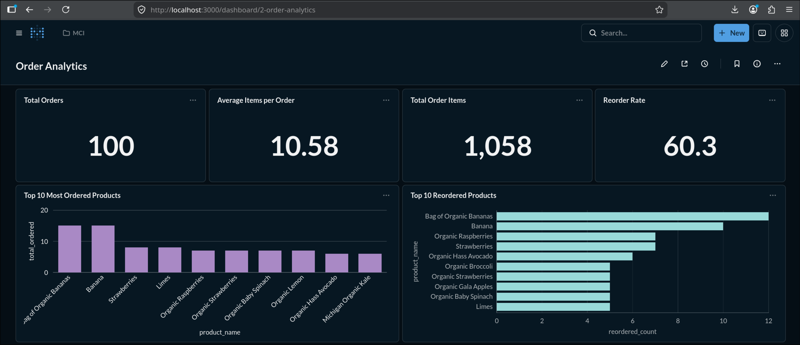
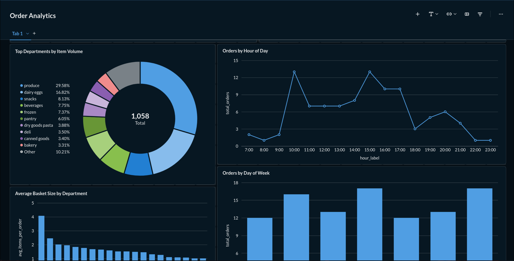
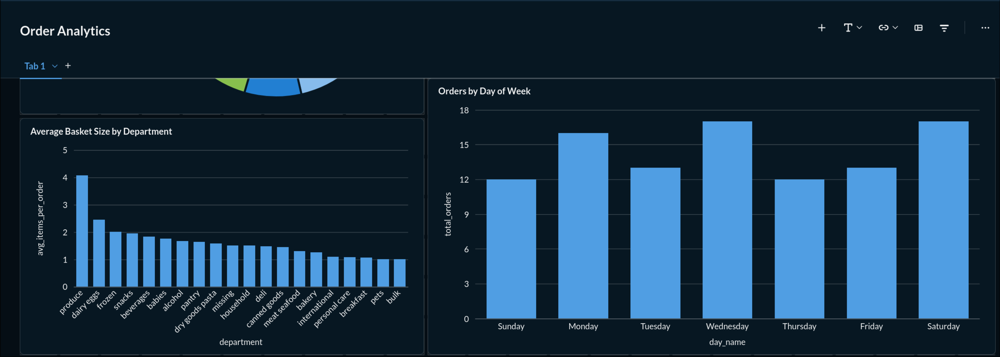
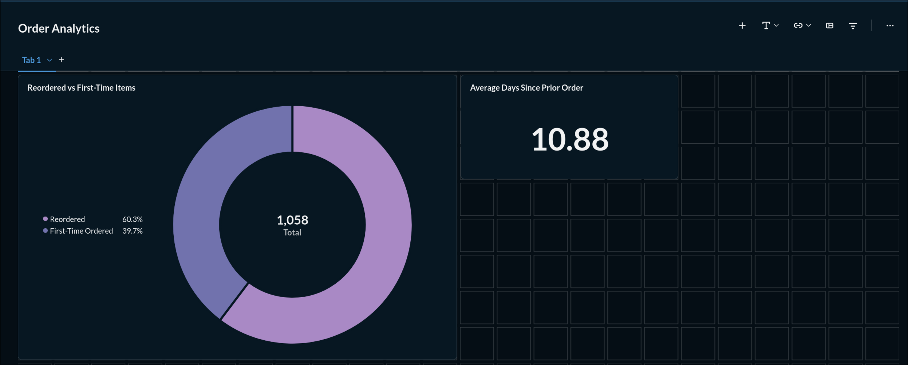

# MCI2026 Task 2 - Kelompok 3

## Pipeline Orchestration & Data Visualization with Airflow, ClickHouse, and Metabase

Project ini merupakan implementasi pipeline data end-to-end yang mencakup proses orchestration, data warehouse, dan business intelligence dashboard. Data order diambil dari API, diproses menggunakan Python ETL, dijalankan melalui Apache Airflow, disimpan ke ClickHouse, lalu divisualisasikan menggunakan Metabase.

Pipeline utama:

```text
Orders API
→ Apache Airflow DAG
→ Python Extract, Transform, Load
→ ClickHouse Data Warehouse
→ Metabase Questions
→ Metabase Dashboard
```

Dataset source:

```text
http://96.9.212.102:8000/orders
```

---

## 1. Project Overview

Project ini bertujuan untuk membangun pipeline data yang dapat mengambil data order dari API, mengubah data nested JSON menjadi bentuk tabular, menyimpan hasil transformasi ke ClickHouse, lalu menampilkannya dalam dashboard Metabase.

Data dari API memiliki struktur nested, yaitu satu order dapat memiliki banyak produk di dalam array `products`. Pada proses transformasi, data tersebut diubah menjadi bentuk tabular dengan struktur:

```text
1 row = 1 product item dalam 1 order
```

Karena itu, analisis pada project ini dibagi menjadi beberapa level:

| Level Analisis | Penjelasan |
|---|---|
| Order-level | Menghitung jumlah order unik, waktu order, dan hari order |
| Item-level | Menghitung total item/produk yang muncul dalam order |
| Product-level | Menganalisis produk paling sering dipesan dan produk yang sering di-reorder |
| Department-level | Menganalisis kontribusi kategori/department |
| Customer behavior | Menganalisis reorder behavior dan jarak pembelian sebelumnya |

---

## 2. Technologies Used

| Technology | Function |
|---|---|
| Docker Compose | Menjalankan seluruh service dalam container |
| Apache Airflow | Orchestration dan scheduling pipeline |
| Python | Proses Extract, Transform, Load |
| ClickHouse | Analytical database / data warehouse |
| Metabase | Business intelligence dashboard dan data visualization |

---

## 3. Project Structure

```text
MCI2026_Task2_Kelompok3/
│
├── dags/
│   └── orders_pipeline.py
│
├── etl/
│   ├── extract.py
│   ├── transform.py
│   └── load.py
│
├── sql/
│   ├── create_database.sql
│   ├── create_table.sql
│   └── metabase_queries.sql
│
├── docs/
│   └── images/
│       ├── airflow_dag_success.png
│       ├── clickhouse_count.png
│       ├── metabase_connection.png
│       ├── metabase_question.png
│       └── metabase_dashboard.png
│
├── docker-compose.yml
├── requirements.txt
├── .gitignore
└── README.md
```

---

## 4. System Architecture

Arsitektur pipeline:

```text
API Orders
   ↓
Airflow DAG
   ↓
Python ETL
   ↓
ClickHouse Table: mci_orders.orders
   ↓
Metabase Questions
   ↓
Metabase Dashboard
```

Service utama:

1. **Airflow**  
   Digunakan untuk menjalankan dan menjadwalkan pipeline ETL.

2. **ClickHouse**  
   Digunakan sebagai data warehouse untuk menyimpan data hasil transformasi.

3. **Metabase**  
   Digunakan untuk membuat question, visualisasi, dan dashboard analitik.

---

## 5. Setup and Run Project

### 5.1 Clone Repository

```bash
git clone https://github.com/KuliahFarhan/MCI2026_Task2_Kelompok3.git
cd MCI2026_Task2_Kelompok3
```

### 5.2 Run Docker Compose

```bash
docker compose up -d
```

Cek container:

```bash
docker ps
```

Container yang seharusnya berjalan:

```text
clickhouse-server
airflow
metabase
```

---

## 6. ClickHouse Data Warehouse

### 6.1 Database

Database yang digunakan:

```sql
CREATE DATABASE IF NOT EXISTS mci_orders;
```

### 6.2 Table Schema

Tabel utama yang digunakan adalah `mci_orders.orders`.

```sql
CREATE TABLE IF NOT EXISTS mci_orders.orders (
    order_id Int32,
    user_id Int32,
    order_number Int32,
    order_dow Int32,
    order_hour_of_day Int32,
    days_since_prior_order Nullable(Float32),
    eval_set String,

    product_id Int32,
    product_name String,

    aisle_id Int32,
    aisle String,

    department_id Int32,
    department String,

    add_to_cart_order Int32,
    reordered Int32
)
ENGINE = MergeTree()
ORDER BY (order_id, product_id);
```

Pemilihan `ORDER BY (order_id, product_id)` digunakan karena data berada pada level item produk dalam order. Satu `order_id` dapat memiliki banyak `product_id`, sehingga kombinasi ini membantu penyimpanan dan pembacaan data analitik berdasarkan order dan produk.

---

## 7. Airflow DAG

DAG yang digunakan:

```text
orders_etl_pipeline
```

Pipeline DAG menjalankan tiga proses utama:

```text
extract_orders()
→ transform_orders()
→ load_to_clickhouse()
```

### 7.1 Extract

Tahap extract mengambil data dari API orders.

### 7.2 Transform

Tahap transform mengubah nested JSON menjadi format tabular. Setiap produk dalam order akan menjadi satu baris data.

### 7.3 Load

Tahap load memasukkan data hasil transformasi ke ClickHouse pada tabel `mci_orders.orders`.

Untuk menjaga data tidak terduplikasi akibat DAG berjalan lebih dari satu kali, proses load dapat melakukan refresh tabel sebelum insert data baru:

```python
client.command("TRUNCATE TABLE mci_orders.orders")
```

### 7.4 Airflow UI

Airflow UI dapat diakses melalui:

```text
http://localhost:8081
```

Login:

```text
Username: admin
Password: admin123
```

Langkah menjalankan DAG:

1. Buka Airflow UI.
2. Cari DAG `orders_etl_pipeline`.
3. Pastikan DAG dalam kondisi aktif.
4. Klik **Trigger DAG**.
5. Pastikan task berhasil dengan status **success**.


---

## 8. Data Validation in ClickHouse

Setelah DAG berhasil dijalankan, data divalidasi melalui ClickHouse.

```bash
docker exec -it clickhouse-server clickhouse-client \
  --user admin \
  --password admin123 \
  --database mci_orders
```

Query validasi:

```sql
SELECT
    COUNT(*) AS total_items,
    COUNT(DISTINCT order_id) AS total_orders
FROM orders;
```

Hasil validasi setelah pipeline berhasil dijalankan:

```text
total_items  = 959
total_orders = 100
```

Interpretasi:

| Metric | Meaning |
|---|---|
| Total Orders | Jumlah order unik |
| Total Items | Jumlah seluruh produk dalam order |
| Average Items per Order | Rata-rata jumlah produk dalam satu order |

Karena data sudah di-flatten, `COUNT(*)` tidak sama dengan jumlah order. `COUNT(*)` merepresentasikan jumlah item, sedangkan jumlah order dihitung menggunakan `COUNT(DISTINCT order_id)`.


---

## 9. Metabase Setup

Metabase UI dapat diakses melalui:

```text
http://localhost:3000
```

Konfigurasi koneksi ClickHouse:

| Field | Value |
|---|---|
| Database Type | ClickHouse |
| Host | clickhouse |
| Port | 8123 |
| Database | mci_orders |
| Username | admin |
| Password | admin123 |

Catatan: host yang digunakan adalah `clickhouse`, bukan `localhost`, karena Metabase dan ClickHouse berjalan dalam Docker network yang sama.


---

## 10. Metabase Questions and Queries

Query analitik yang digunakan pada Metabase juga disimpan pada file:

```text
sql/metabase_queries.sql
```

Seluruh query menggunakan full table name `mci_orders.orders` agar tidak terjadi error `UNKNOWN_TABLE` ketika dijalankan dari Metabase.

---

### 10.1 Total Orders

Visualisasi: **Number**

```sql
SELECT COUNT(DISTINCT order_id) AS total_orders
FROM mci_orders.orders;
```

Metrik ini menunjukkan jumlah order unik yang tersedia dalam dataset.

---

### 10.2 Total Order Items

Visualisasi: **Number**

```sql
SELECT COUNT(*) AS total_order_items
FROM mci_orders.orders;
```

Metrik ini menunjukkan jumlah seluruh item produk dalam order. Karena tabel berada pada level item, nilai ini lebih besar daripada jumlah order.

---

### 10.3 Average Items per Order

Visualisasi: **Number**

```sql
SELECT
    ROUND(COUNT(*) / COUNT(DISTINCT order_id), 2) AS avg_items_per_order
FROM mci_orders.orders;
```

Metrik ini menunjukkan rata-rata jumlah item dalam setiap order.

---

### 10.4 Reorder Rate

Visualisasi: **Number / Gauge**

```sql
SELECT
    ROUND(100.0 * SUM(reordered) / COUNT(*), 2) AS reorder_rate_percent
FROM mci_orders.orders;
```

Metrik ini menunjukkan persentase item yang merupakan pembelian ulang.

---

### 10.5 Top 10 Most Ordered Products

Visualisasi: **Horizontal Bar Chart**

```sql
-- Top 10 Most Ordered Products
SELECT
    product_name,
    COUNT(*) AS total_ordered
FROM mci_orders.orders
GROUP BY product_name
ORDER BY total_ordered DESC
LIMIT 10;
```

Visualisasi ini digunakan untuk melihat produk yang paling sering muncul dalam order.

---

### 10.6 Top 10 Reordered Products

Visualisasi: **Horizontal Bar Chart / Table**

```sql
-- Top 10 reordered
SELECT
    product_name,
    COUNT(*) AS reordered_count
FROM mci_orders.orders
WHERE reordered = 1
GROUP BY product_name
ORDER BY reordered_count DESC
LIMIT 10;
```

Visualisasi ini digunakan untuk melihat produk yang paling sering dibeli ulang.

---

### 10.7 Orders by Department

Visualisasi: **Donut Chart / Pie Chart / Bar Chart**

```sql
-- orders by departement
SELECT
    department,
    COUNT(*) AS total_items
FROM mci_orders.orders
GROUP BY department
ORDER BY total_items DESC;
```

Visualisasi ini menunjukkan kontribusi setiap department terhadap total item dalam order.

---

### 10.8 Average Basket Size by Department

Visualisasi: **Bar Chart**

```sql
-- average basket size
SELECT
    department,
    ROUND(COUNT(*) / COUNT(DISTINCT order_id), 2) AS avg_items_per_order
FROM mci_orders.orders
GROUP BY department
ORDER BY avg_items_per_order DESC;
```

Visualisasi ini menunjukkan rata-rata jumlah item per order berdasarkan department.

---

### 10.9 Orders by Hour of a Day

Visualisasi: **Bar Chart / Line Chart**

```sql
-- order by hours of a day
SELECT
    concat(toString(order_hour_of_day), ':00') AS hour_label,
    COUNT(DISTINCT order_id) AS total_orders
FROM mci_orders.orders
GROUP BY order_hour_of_day, hour_label
ORDER BY order_hour_of_day;
```

Visualisasi ini menunjukkan distribusi order berdasarkan jam dalam satu hari.

---

### 10.10 Orders by Day of Week

Visualisasi: **Vertical Bar Chart**

```sql
-- order by day a week
SELECT
    CASE order_dow
        WHEN 0 THEN 'Sunday'
        WHEN 1 THEN 'Monday'
        WHEN 2 THEN 'Tuesday'
        WHEN 3 THEN 'Wednesday'
        WHEN 4 THEN 'Thursday'
        WHEN 5 THEN 'Friday'
        WHEN 6 THEN 'Saturday'
    END AS day_name,
    COUNT(DISTINCT order_id) AS total_orders
FROM mci_orders.orders
GROUP BY order_dow, day_name
ORDER BY order_dow;
```

Visualisasi ini menunjukkan distribusi order berdasarkan hari dalam satu minggu.

---

### 10.11 Reordered vs First-Time Items

Visualisasi: **Donut Chart / Pie Chart**

```sql
-- reorder vs first
SELECT
    CASE
        WHEN reordered = 1 THEN 'Reordered'
        ELSE 'First-Time Ordered'
    END AS order_type,
    COUNT(*) AS total_items
FROM mci_orders.orders
GROUP BY order_type
ORDER BY total_items DESC;
```

Visualisasi ini membandingkan jumlah item yang merupakan pembelian ulang dan pembelian pertama.

---

### 10.12 Average Days Since Prior Order

Visualisasi: **Number**

```sql
-- avg days since prior
SELECT
    ROUND(AVG(days_since_prior_order), 2) AS avg_days_since_prior_order
FROM mci_orders.orders
WHERE days_since_prior_order IS NOT NULL;
```

Metrik ini menunjukkan rata-rata jeda hari sejak order sebelumnya.


---

## 11. Dashboard Design

Dashboard yang dibuat bernama:

```text
Instacart Order Behavior Analytics
```

Dashboard disusun agar tidak hanya menampilkan data mentah, tetapi juga memberikan insight bisnis terkait perilaku order, performa produk, kontribusi department, waktu pembelian, dan reorder behavior.

Layout dashboard:

```text
Row 1: KPI Summary
[Total Orders] [Total Order Items] [Avg Items per Order] [Reorder Rate]

Row 2: Product Performance
[Top 10 Most Ordered Products] [Top 10 Reordered Products]

Row 3 & 4: Category Analysis and Time Behavior
[Orders by Department] [Orders by Hour of a Day]  
[Average Basket Size by Department][Orders by Day of Week]

Row 5: Customer Behavior
[Reordered vs First-Time Items] [Avg Days Since Prior Order]
```

Variasi visualisasi yang digunakan:

| Section | Visualization Type |
|---|---|
| KPI Summary | Number / Gauge |
| Product Performance | Horizontal Bar / Table |
| Category Analysis | Donut / Bar |
| Time Behavior | Bar / Line |
| Customer Behavior | Donut / Number |





---

## 12. Business Insight

Dashboard ini membantu menganalisis perilaku pembelian pelanggan berdasarkan data order dan produk. Karena data disimpan pada level item, analisis dapat dilakukan secara lebih detail, mulai dari jumlah order unik, jumlah item dalam order, produk paling sering dibeli, hingga pola reorder.

Beberapa insight utama yang dapat diperoleh:

1. **Basket Size Analysis**  
   Average Items per Order menunjukkan rata-rata jumlah produk dalam satu order. Metrik ini berguna untuk memahami ukuran keranjang belanja pelanggan.

2. **Product Performance**  
   Produk dengan jumlah order tertinggi dapat menjadi prioritas dalam pengelolaan stok, promosi, dan rekomendasi produk.

3. **Reorder Behavior**  
   Reorder Rate menunjukkan seberapa besar proporsi item yang merupakan pembelian ulang. Produk dengan reorder tinggi dapat dimanfaatkan untuk loyalty program, bundling, atau rekomendasi personal.

4. **Department Contribution**  
   Analisis department membantu melihat kategori produk yang paling dominan dalam transaksi. Informasi ini dapat digunakan untuk menentukan prioritas inventory berdasarkan kategori.

5. **Time-Based Behavior**  
   Distribusi order berdasarkan jam dan hari dapat membantu menentukan waktu terbaik untuk promosi, push notification, atau campaign penjualan.

---

## 13. Common Issues

### 13.1 Airflow DAG Paused

Jika DAG tidak berjalan otomatis, pastikan DAG tidak dalam kondisi paused.

```bash
docker exec -it airflow bash -lc "airflow dags unpause orders_etl_pipeline"
```

### 13.2 ModuleNotFoundError: clickhouse_connect

Jika muncul error dependency pada Airflow, pastikan dependency sudah tersedia di container.

```bash
docker exec -it airflow bash -lc "python -c 'import clickhouse_connect, requests; print(\"OK\")'"
```

### 13.3 ClickHouse Table Not Found in Metabase

Gunakan full table name pada query:

```sql
FROM mci_orders.orders
```

bukan hanya:

```sql
FROM orders
```

### 13.4 Duplicate Data Because of Multiple DAG Runs

Jika data bertambah setiap DAG berjalan, pastikan proses load melakukan refresh data sebelum insert.

```python
client.command("TRUNCATE TABLE mci_orders.orders")
```

---

## 14. Contributors

Kelompok 3 - MCI 2026
